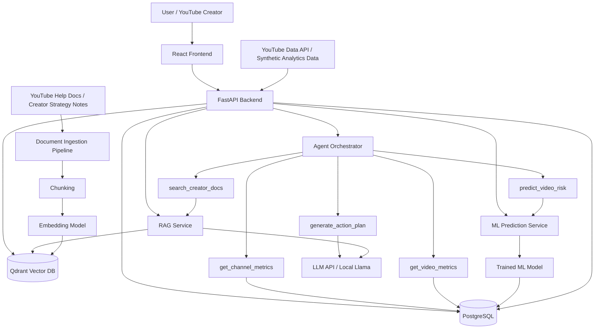
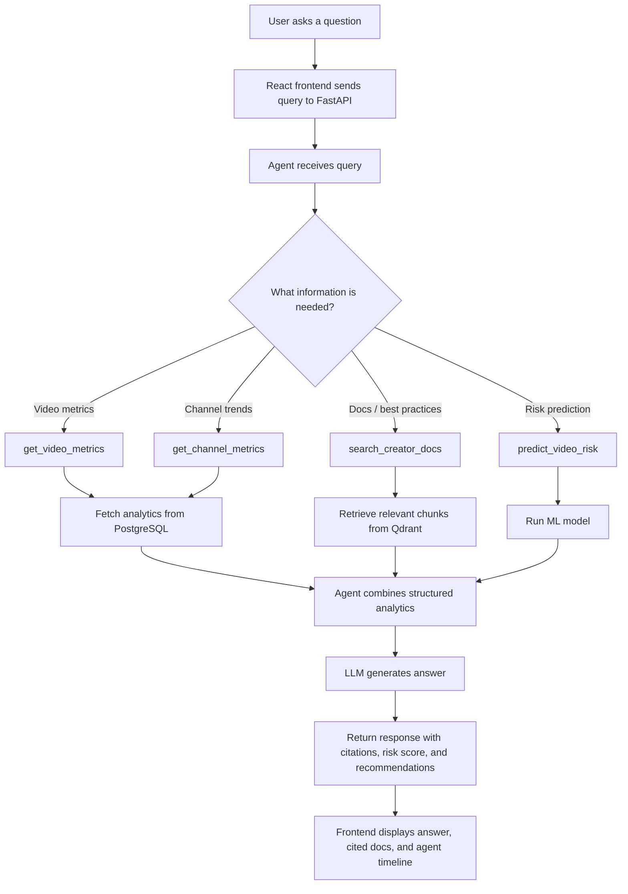
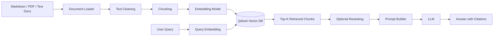
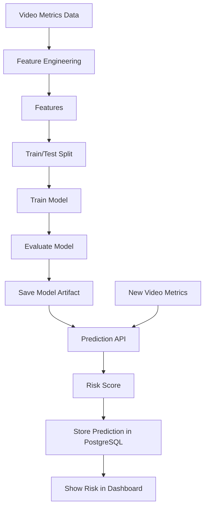
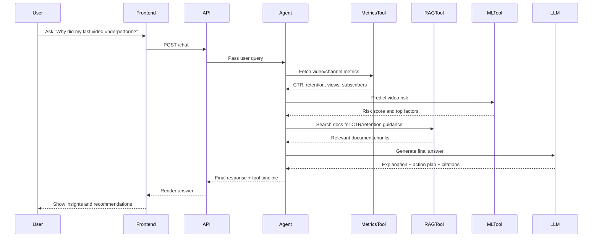
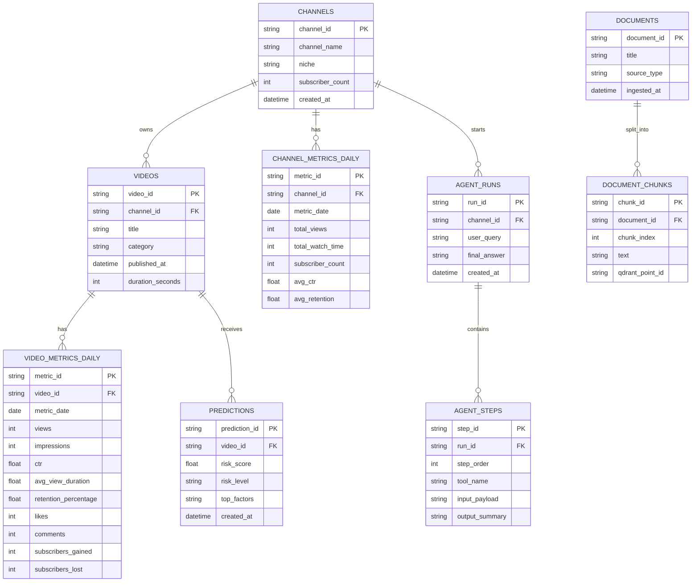

# YouTube Creator Copilot

**Agentic RAG + ML Assistant for YouTube Channel Growth, Video Performance, and Creator Strategy**

YouTube Creator Copilot is a production-style AI/ML project that helps creators understand why their videos underperform, identify growth risks, retrieve relevant YouTube policy or strategy guidance, and generate actionable next-step recommendations.

The project combines **RAG**, **agentic workflows**, **ML prediction**, **backend APIs**, **vector search**, **PostgreSQL analytics storage**, and a **React dashboard** into one practical AI engineering system.

---

## Why This Project Exists

Most creator analytics dashboards show raw metrics:

- views
- impressions
- CTR
- watch time
- average view duration
- subscribers gained/lost
- revenue estimates

But creators still struggle to answer the real questions:

- Why did this video underperform?
- Was the problem CTR, retention, upload timing, topic choice, or consistency?
- What should I improve before the next upload?
- What do YouTube monetization or best-practice documents say about this issue?
- Which videos are at risk of performing poorly?
- What action plan should I follow this week?

YouTube Creator Copilot turns analytics into explanations and action plans.

---

## Core Idea

A creator can ask questions like:

```text
Why did my last 3 videos underperform?
Which video is most likely to perform badly next week?
What should I improve to increase watch time?
What does YouTube say about monetization eligibility?
Give me an action plan for my next upload.
Summarize what is hurting my channel growth.
```

The system answers by combining:

1. **YouTube-style channel/video analytics**
2. **RAG over creator strategy and YouTube help documents**
3. **ML prediction for video underperformance risk**
4. **Agentic workflow that calls backend tools**
5. **LLM-generated explanation with citations and recommendations**

---

## Key Features

### 1. Ask AI

A chat interface where the creator asks natural-language questions about their channel.

Example:

```text
Why did my latest video perform worse than usual?
```

The assistant can respond with:

```text
Your latest video appears to have underperformed mainly because its CTR dropped from your channel average of 7.8% to 3.1%, and its average view duration fell by 28%.

The model also assigned this video a 0.76 underperformance risk score.

Recommended actions:
1. Improve title-thumbnail alignment.
2. Rework the first 30 seconds to reduce early drop-off.
3. Compare this topic against your top-performing videos.
4. Test a clearer thumbnail with fewer visual elements.
```

---

### 2. Video Risk Predictor

A machine learning model predicts whether a video is likely to underperform.

Possible model output:

```json
{
  "video_id": "vid_102",
  "performance_risk_score": 0.76,
  "risk_level": "high",
  "top_factors": [
    "low_ctr",
    "low_average_view_duration",
    "negative_subscriber_delta"
  ]
}
```

---

### 3. RAG Over YouTube and Creator Documents

The system retrieves relevant chunks from documents such as:

- YouTube monetization policy notes
- Creator growth strategy notes
- Thumbnail and title best practices
- Audience retention improvement notes
- Upload consistency recommendations
- Shorts vs long-form strategy notes
- Channel review playbooks

The final answer includes citations from retrieved documents.

---

### 4. Agentic Workflow

The assistant does not blindly answer from a prompt. It decides which tools are needed.

Example user query:

```text
Why did my last 3 videos underperform and what should I do next?
```

The agent may call:

1. `get_recent_videos(channel_id)`
2. `get_video_metrics(video_id)`
3. `predict_video_risk(video_id)`
4. `search_creator_docs(query)`
5. `generate_growth_plan(channel_id)`

Then it combines all results into one explanation.

---

### 5. Agent Timeline

The UI shows how the assistant reached an answer.

Example timeline:

```text
Step 1: Fetched last 3 uploaded videos
Step 2: Retrieved video analytics from PostgreSQL
Step 3: Ran ML underperformance prediction
Step 4: Retrieved relevant creator strategy documents from Qdrant
Step 5: Generated explanation and action plan
```

This makes the system transparent, debuggable, and interview-friendly.

---

## High-Level Architecture



---

## User Flow Diagram



---

## RAG Pipeline



---

## ML Prediction Pipeline



---

## Agentic Workflow



---

## System Components

### Frontend

Built with **React + TypeScript**.

Main pages:

```text
Ask AI
Video Risk Dashboard
Channel Insights
Agent Timeline
Document Explorer
```

Frontend responsibilities:

- send user questions to backend
- display AI answers
- show cited sources
- show video risk scores
- visualize channel metrics
- display agent execution timeline

---

### Backend

Built with **FastAPI**.

Backend responsibilities:

- expose REST APIs
- run the agent workflow
- serve video/channel analytics
- run ML predictions
- connect to PostgreSQL
- connect to Qdrant
- call LLM APIs or local models
- log agent runs and tool calls

Example APIs:

```text
POST   /chat
GET    /channels/{channel_id}
GET    /videos/{video_id}
GET    /videos/{video_id}/metrics
POST   /predictions/video-risk
POST   /documents/ingest
GET    /agent-runs/{run_id}
```

---

### PostgreSQL

Stores structured application data.

Core tables:

```text
channels
videos
video_metrics_daily
channel_metrics_daily
predictions
agent_runs
agent_steps
documents
document_chunks_metadata
```

---

### Qdrant Vector Database

Stores document chunk embeddings for semantic search.

Example collections:

```text
creator_docs
youtube_policy_docs
strategy_notes
```

---

### ML Model

The first version can use:

```text
scikit-learn
RandomForestClassifier
LogisticRegression
XGBoost optional
```

Prediction target:

```text
video_underperformed = true / false
```

or

```text
performance_risk_score = 0.0 to 1.0
```

---

## Example ML Features

```text
impressions
click_through_rate
average_view_duration
watch_time_minutes
retention_percentage
likes_count
comments_count
subscriber_gain
subscriber_loss
upload_gap_days
title_length
description_length
publish_hour
publish_day_of_week
previous_video_avg_views
channel_avg_ctr
channel_avg_retention
```

---

## Example Prediction Logic

A video can be labeled as underperforming if:

```text
video_views < 0.65 * channel_average_views
```

or if a combined score is low:

```text
underperformance_score =
    weighted_ctr_drop
  + weighted_retention_drop
  + weighted_watch_time_drop
  + weighted_subscriber_loss
```

This allows synthetic data generation without needing real YouTube API data in the MVP.

---

## Data Strategy

### MVP Data

Start with synthetic YouTube analytics-style CSV files:

```text
channels.csv
videos.csv
video_metrics_daily.csv
creator_docs/
```

This keeps the project simple and reproducible.

### Later Extension

Add YouTube API integration:

```text
YouTube Data API
YouTube Analytics API
OAuth consent flow
Real channel/video metrics ingestion
```

---

## Recommended Tech Stack

```text
Frontend:        React, TypeScript, Tailwind
Backend:         FastAPI, Python
Agent:           LangGraph or custom agent orchestrator
RAG:             LlamaIndex or LangChain
Vector DB:       Qdrant
Database:        PostgreSQL
ML:              scikit-learn, pandas, joblib
LLM:             OpenAI API, Anthropic API, or local Llama
Infra:           Docker Compose
Testing:         pytest
CI/CD:           GitHub Actions
Monitoring:      structured logs, eval reports, agent run traces
```

---

## Local Development

Phase 01 provides the runnable project skeleton.

Start PostgreSQL and Qdrant:

```bash
docker compose up -d postgres qdrant
```

Start the backend:

```bash
cd backend
python -m venv .venv
source .venv/bin/activate
pip install -r requirements.txt
uvicorn app.main:app --reload
```

Backend health check:

```bash
curl http://localhost:8000/health
```

Start the frontend:

```bash
cd frontend
npm install
npm run dev
```

Open the dashboard at:

```text
http://localhost:5173
```

---

## Project Structure

```text
youtube-creator-copilot/
├── backend/
│   ├── app/
│   │   ├── api/
│   │   │   ├── chat.py
│   │   │   ├── videos.py
│   │   │   ├── channels.py
│   │   │   ├── predictions.py
│   │   │   └── documents.py
│   │   │
│   │   ├── agents/
│   │   │   ├── creator_agent.py
│   │   │   ├── tools.py
│   │   │   └── schemas.py
│   │   │
│   │   ├── rag/
│   │   │   ├── ingestion.py
│   │   │   ├── chunking.py
│   │   │   ├── embeddings.py
│   │   │   ├── retrieval.py
│   │   │   └── prompts.py
│   │   │
│   │   ├── ml/
│   │   │   ├── train.py
│   │   │   ├── predict.py
│   │   │   ├── features.py
│   │   │   └── model_registry.py
│   │   │
│   │   ├── db/
│   │   │   ├── models.py
│   │   │   ├── session.py
│   │   │   └── seed.py
│   │   │
│   │   ├── evals/
│   │   │   ├── rag_eval.py
│   │   │   ├── agent_eval.py
│   │   │   └── test_questions.json
│   │   │
│   │   ├── core/
│   │   │   ├── config.py
│   │   │   └── logging.py
│   │   │
│   │   └── main.py
│   │
│   ├── tests/
│   │   ├── test_rag.py
│   │   ├── test_predictions.py
│   │   └── test_agent_tools.py
│   │
│   ├── Dockerfile
│   └── requirements.txt
│
├── frontend/
│   ├── src/
│   │   ├── pages/
│   │   │   ├── AskAI.tsx
│   │   │   ├── VideoRisk.tsx
│   │   │   ├── ChannelInsights.tsx
│   │   │   └── AgentTimeline.tsx
│   │   │
│   │   ├── components/
│   │   │   ├── ChatPanel.tsx
│   │   │   ├── RiskTable.tsx
│   │   │   ├── MetricCard.tsx
│   │   │   ├── CitationCard.tsx
│   │   │   └── AgentStepTimeline.tsx
│   │   │
│   │   ├── api/
│   │   │   └── client.ts
│   │   │
│   │   └── App.tsx
│   │
│   └── package.json
│
├── docs/
│   ├── youtube_monetization.md
│   ├── creator_best_practices.md
│   ├── retention_tips.md
│   ├── title_thumbnail_strategy.md
│   └── upload_consistency.md
│
├── data/
│   ├── channels.csv
│   ├── videos.csv
│   └── video_metrics_daily.csv
│
├── models/
│   └── video_risk_model.joblib
│
├── docker-compose.yml
├── README.md
└── .github/
    └── workflows/
        └── ci.yml
```

---

## Database Schema



---

## API Design

### Chat API

```http
POST /chat
```

Request:

```json
{
  "channel_id": "channel_001",
  "query": "Why did my last video underperform?"
}
```

Response:

```json
{
  "answer": "Your latest video likely underperformed because CTR dropped and retention declined...",
  "risk_score": 0.76,
  "citations": [
    {
      "title": "Title and Thumbnail Strategy",
      "chunk_id": "chunk_019"
    }
  ],
  "agent_steps": [
    {
      "step": 1,
      "tool": "get_recent_videos",
      "summary": "Fetched latest uploaded video"
    },
    {
      "step": 2,
      "tool": "predict_video_risk",
      "summary": "Computed high risk score of 0.76"
    }
  ]
}
```

---

### Prediction API

```http
POST /predictions/video-risk
```

Request:

```json
{
  "video_id": "video_102"
}
```

Response:

```json
{
  "video_id": "video_102",
  "risk_score": 0.76,
  "risk_level": "high",
  "top_factors": [
    "low_ctr",
    "low_retention",
    "subscriber_loss"
  ]
}
```

---

### Document Ingestion API

```http
POST /documents/ingest
```

Request:

```json
{
  "path": "docs/creator_best_practices.md"
}
```

Response:

```json
{
  "document_id": "doc_001",
  "chunks_created": 18,
  "status": "indexed"
}
```

---

## Implementation Plan

The project should be built as a sequence of focused GitHub branches and pull requests so the commit history tells the story of the product. Use the detailed phase docs as the source of truth for branch names, commit order, acceptance criteria, and verification steps:

```text
docs/phases/
├── README.md
├── phase-00-repo-foundation.md
├── phase-01-project-skeleton.md
├── phase-02-synthetic-data.md
├── phase-03-risk-predictor.md
├── phase-04-rag-pipeline.md
├── phase-05-agent-orchestrator.md
├── phase-06-react-dashboard.md
└── phase-07-evals-ci-polish.md
```

Recommended branch flow:

```text
main
└── phase/00-repo-foundation
└── phase/01-project-skeleton
└── phase/02-synthetic-data
└── phase/03-risk-predictor
└── phase/04-rag-pipeline
└── phase/05-agent-orchestrator
└── phase/06-react-dashboard
└── phase/07-evals-ci-polish
```

Each phase should be opened as a GitHub PR, reviewed, merged into `main`, and tagged when useful. Keep commits small and named after completed behavior, for example `add fastapi health endpoint`, `seed synthetic video metrics`, or `persist agent run timeline`.

### Phase 1: Project Setup

Goal: create the skeleton.

Tasks:

- create backend FastAPI app
- create React frontend
- add Docker Compose
- add PostgreSQL and Qdrant containers
- add environment variables
- add basic health check endpoint

Commit examples:

```text
init project structure
add docker compose for postgres and qdrant
add fastapi health endpoint
add react app shell
```

---

### Phase 2: Synthetic YouTube Analytics Data

Goal: create realistic seed data.

Tasks:

- generate channels
- generate videos
- generate daily video metrics
- generate channel metrics
- seed PostgreSQL

Example data:

```text
channel_001
video_101
ctr = 3.2
avg_view_duration = 121 sec
retention_percentage = 41.5
views = 12000
impressions = 370000
```

Commit examples:

```text
add synthetic youtube analytics dataset
add postgres schema for channels and videos
add database seeding script
```

---

### Phase 3: ML Video Risk Predictor

Goal: train a simple model.

Tasks:

- create feature engineering pipeline
- label underperforming videos
- train RandomForest or Logistic Regression
- save model with joblib
- expose /predictions/video-risk

Evaluation metrics:

```text
accuracy
precision
recall
f1 score
roc_auc
```

Commit examples:

```text
add video underperformance feature pipeline
train baseline video risk model
expose prediction api
add tests for prediction service
```

---

### Phase 4: RAG Pipeline

Goal: answer questions from documents.

Tasks:

- create markdown docs
- build document loader
- implement chunking
- generate embeddings
- store chunks in Qdrant
- retrieve top-k chunks
- generate answer with citations

Commit examples:

```text
add creator strategy docs
implement document chunking pipeline
index embeddings into qdrant
add rag retrieval service
```

---

### Phase 5: Agent Orchestrator

Goal: combine tools.

Agent tools:

```text
get_channel_metrics
get_recent_videos
get_video_metrics
predict_video_risk
search_creator_docs
generate_action_plan
```

Tasks:

- implement tool schemas
- add agent decision flow
- log each tool call
- save agent run timeline
- return answer + steps to frontend

Commit examples:

```text
add creator agent tool interface
implement video analysis agent workflow
persist agent run timeline
```

---

### Phase 6: React Dashboard

Goal: make the project demo-ready.

Pages:

```text
Ask AI
Video Risk Dashboard
Channel Insights
Agent Timeline
```

UI components:

```text
ChatPanel
RiskTable
MetricCard
CitationCard
AgentStepTimeline
```

Commit examples:

```text
add ask ai page
add video risk dashboard
add agent timeline component
connect frontend to chat api
```

---

### Phase 7: Evaluation and Monitoring

Goal: make it production-style.

Tasks:

- add RAG evaluation questions
- test if retrieved chunks are relevant
- test if citations are returned
- log latency for chat requests
- log model prediction outputs
- add GitHub Actions CI

Commit examples:

```text
add rag evaluation dataset
add agent workflow tests
add structured logging for chat requests
add github actions ci
```

---

## MVP Scope

The first strong version should include:

- synthetic YouTube analytics data
- PostgreSQL schema and seed script
- video underperformance ML model
- Qdrant vector search
- RAG over 5 to 10 creator docs
- one agent workflow
- Ask AI page
- Video Risk table
- Agent Timeline page
- Docker Compose
- README with diagrams and demo commands

This is enough to make the project impressive and interview-ready without becoming too large.

---

## Example Demo Script

### Demo 1: Ask why a video underperformed

User query:

```text
Why did my latest video underperform?
```

Expected system behavior:

```text
1. Fetch latest video
2. Fetch its CTR, views, retention, and subscriber delta
3. Compare against channel average
4. Run ML risk predictor
5. Retrieve title/thumbnail and retention guidance from docs
6. Generate answer with recommendations
```

---

### Demo 2: Find highest-risk videos

User opens:

```text
Video Risk Dashboard
```

System shows:

```text
Video Title
Risk Score
CTR
Retention
Top Risk Factors
Recommended Action
```

---

### Demo 3: Show agent transparency

User opens:

```text
Agent Timeline
```

System shows:

```text
Tool calls
Inputs
Outputs
Final answer
Retrieved documents
Model prediction
```

---

## What This Project Demonstrates

This project demonstrates practical AI engineering skills:

```text
RAG systems
vector databases
document ingestion
chunking strategies
embedding search
LLM prompting
agentic workflows
tool calling
ML model training
model inference APIs
PostgreSQL data modeling
FastAPI backend development
React frontend development
Dockerized deployment
testing and CI
evaluation and monitoring
```

It also connects naturally to backend engineering:

```text
API design
database schemas
service orchestration
logging
reliability
structured workflows
production-style architecture
```

---

## Future Extensions

Possible improvements after MVP:

- connect real YouTube Data API
- OAuth login for YouTube channels
- add actual YouTube Analytics API integration
- add background ingestion jobs
- add Redis caching
- add Celery worker for document ingestion
- add reranking model for better RAG
- add LangGraph for more advanced agent state
- add model monitoring dashboard
- add A/B testing suggestions for thumbnails and titles
- add video script analyzer
- add comment sentiment analysis
- deploy on AWS/GCP
- add Kubernetes manifests

---

## Suggested Repository Name

```text
youtube-creator-copilot
```

Alternative names:

```text
tubepilot-ai
creator-insight-ai
youtube-growth-agent
creator-ops-ai
```

Best name:

```text
youtube-creator-copilot
```

It is clear, professional, and immediately understandable.

---

## Final Pitch

**YouTube Creator Copilot** is an AI engineering project that turns YouTube analytics into explanations, predictions, and action plans.

It combines a production-style backend with RAG, vector search, ML predictions, and agentic workflows. The project is intentionally designed to demonstrate the kind of skills needed for AI Engineer, Backend SDE, ML Platform, and Infrastructure roles.

Instead of being just another chatbot, it behaves like a real AI product: it retrieves evidence, calls tools, runs predictions, explains reasoning through an agent timeline, and gives creators specific recommendations they can act on.
